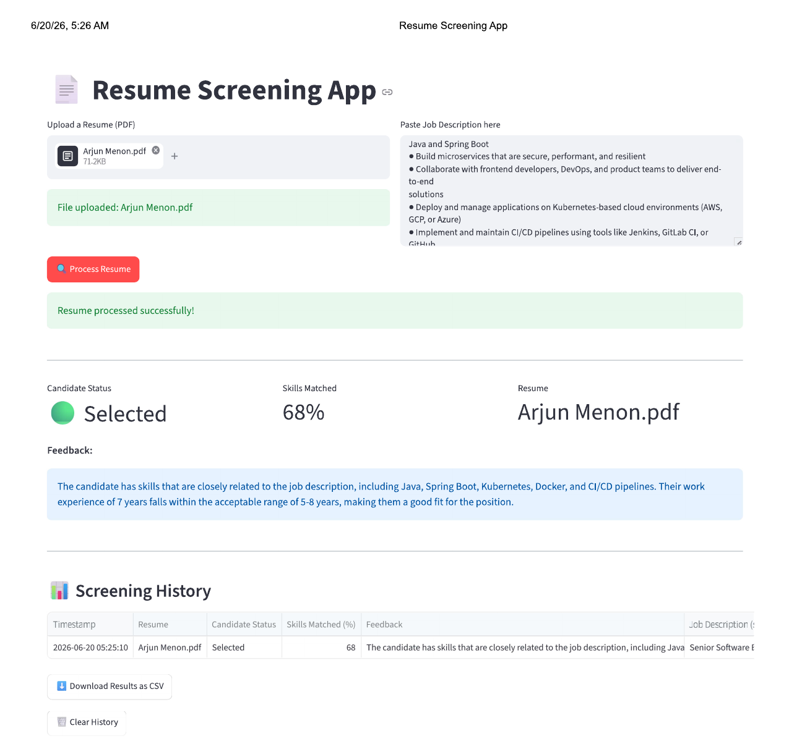
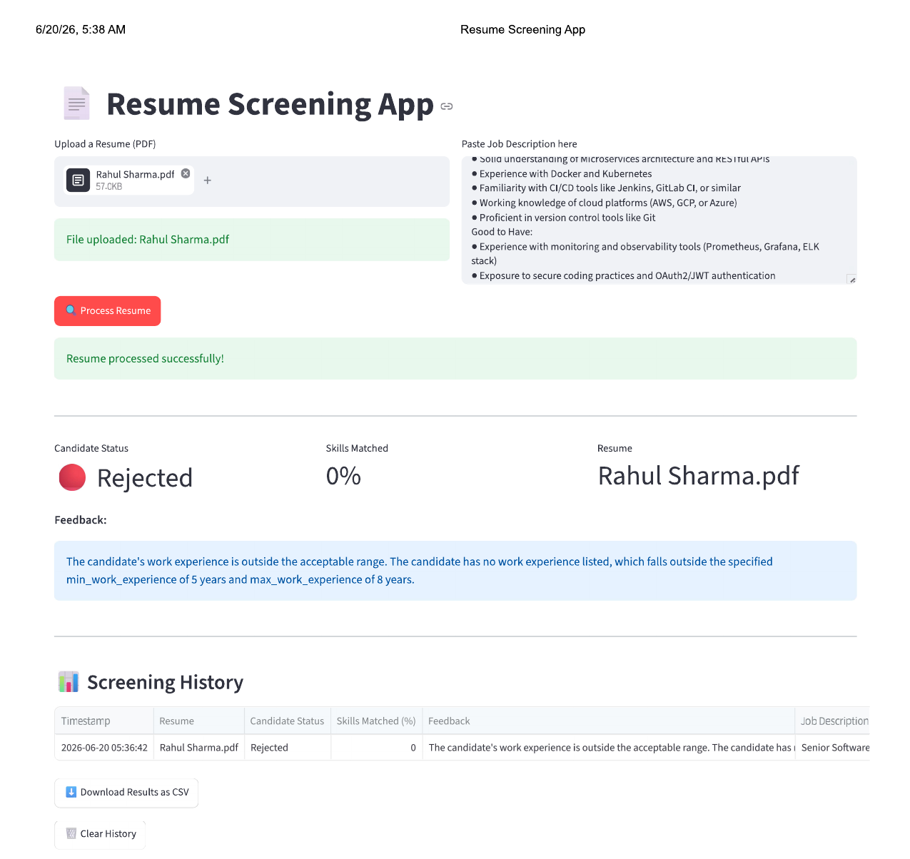
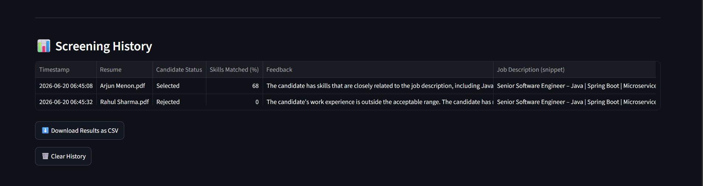
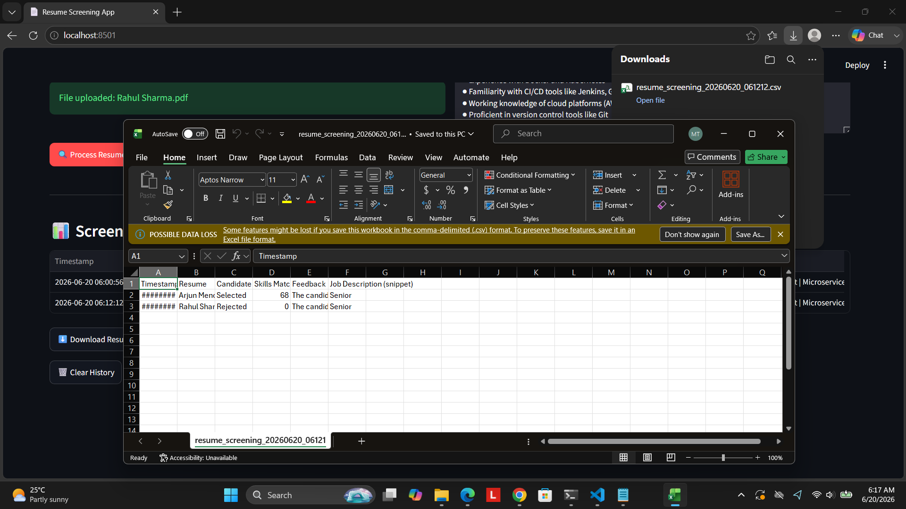
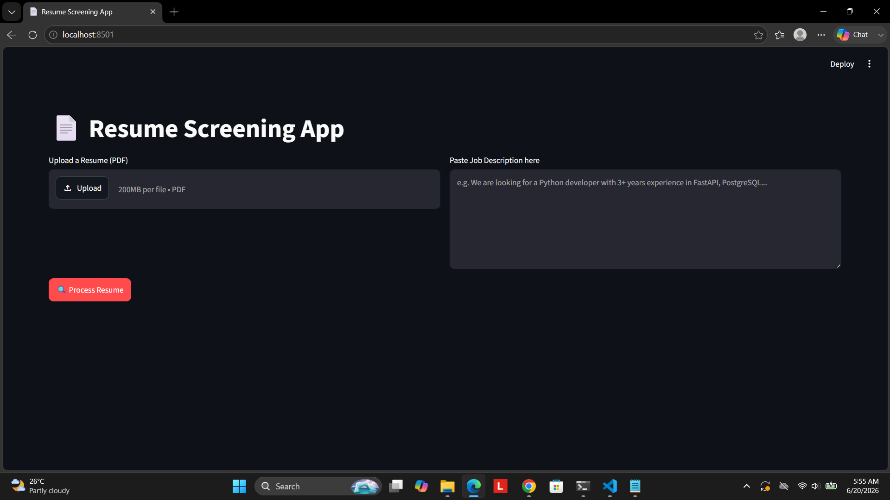

# 🤖 Agentic Resume Screening App

An AI-powered resume screening application built with a **multi-agent architecture**,
using a **free, open-source local LLM (Llama 3.2 via Ollama)** — no paid API keys required.

Upload a candidate's resume (PDF) and a job description, and get an instant intelligent
evaluation — including candidate status, detailed feedback, and a skills match score.
Screen multiple candidates in one session and export all results as CSV.

---

## 📸 Demo

**Candidate matching the job description — Selected:**



**Candidate not matching the job description — Rejected:**



**Screening history with multiple candidates tracked in one session:**



**Export results to CSV for sharing with hiring teams:**



**Full app UI:**



> Same job description, two different candidates — the app correctly distinguishes a
> strong match (68% skills matched, Selected) from a weak match (0%, Rejected due to
> missing work experience), proving the evaluation is genuinely reasoning over the
> content rather than returning a fixed result.

---

## 🏗️ Architecture

```
Browser (Streamlit UI :8501)
        │
        ▼
FastAPI Backend (:8000)
        │
        ├── resume_extractor_agent   → Extracts candidate details from PDF
        ├── jd_extractor_agent       → Parses job description requirements
        └── candidate_evaluation_agent → Scores and evaluates fit
                │
                ▼
        Ollama (local LLM :11434)
        Model: llama3.2 (free, offline, no API key)
```

---

## 🛠️ Tech Stack

| Layer | Technology |
|---|---|
| Frontend UI | Streamlit |
| Backend API | FastAPI + Uvicorn |
| AI / LLM | Ollama (llama3.2) — local, free, no API key |
| PDF Parsing | PyPDF2 |
| Data Export | pandas (CSV) |
| Language | Python 3.10+ |

---

## ✨ Features

- 📄 Upload any PDF resume + paste any job description for instant AI evaluation
- 🧠 Multi-agent pipeline: separate agents for resume extraction, JD parsing, and evaluation
- 🆓 Fully free — runs on a local LLM via Ollama, zero API costs
- 🔒 Private — resume data never leaves your machine, works fully offline
- 📊 Returns candidate status (Selected/Rejected), feedback summary, and skills match %
- 📈 Screening history table tracks every candidate processed in a session
- ⬇️ One-click CSV export of all screening results

---

## 🚀 Getting Started

### Prerequisites

- Python 3.10+
- [Ollama](https://ollama.com) installed

### 1. Clone the repository

```bash
git clone https://github.com/Sudharshika/agentic-resume-screening.git
cd agentic-resume-screening
```

### 2. Install dependencies

```bash
pip install -r requirements.txt
```

### 3. Pull the LLM model (one-time, ~2GB download)

```bash
ollama pull llama3.2
```

### 4. Run the app (3 terminals needed)

**Terminal 1 — Start Ollama:**
```bash
ollama serve
```

**Terminal 2 — Start FastAPI backend:**
```bash
python -m uvicorn app.main:app --reload
```

**Terminal 3 — Start Streamlit frontend:**
```bash
python -m streamlit run app/ui/streamlit.py
```

### 5. Open in browser

Go to **http://localhost:8501**, upload a PDF resume, paste a job description, and
click **Process Resume**.

---

## 📁 Project Structure

```
agentic-resume-screening/
├── app/
│   ├── agents/
│   │   ├── candidate_evaluation_agent.py  # Evaluates resume vs JD
│   │   ├── jd_extractor_agent.py          # Extracts JD requirements
│   │   └── resume_extractor_agent.py      # Extracts resume details
│   ├── ui/
│   │   └── streamlit.py                   # Streamlit frontend
│   ├── main.py                            # FastAPI app entry point
│   ├── parsepdf.py                        # PDF text extraction
│   └── prompts.py                         # LLM prompt templates
├── demo/
│   ├── selected-candidate/                # Screenshots: strong-match example
│   ├── rejected-candidate/                # Screenshots: weak-match example
│   ├── screening-history.png
│   ├── csv-export.png
│   └── resume-screening-app-ui.png
├── requirements.txt
├── .gitignore
└── README.md
```
---

## 💡 How It Works

1. **Upload** — User uploads a PDF resume and pastes a job description via the Streamlit UI
2. **Extract** — `resume_extractor_agent` uses the local LLM to parse the resume into structured data (name, skills, experience, education)
3. **Parse JD** — `jd_extractor_agent` extracts requirements from the job description text
4. **Evaluate** — `candidate_evaluation_agent` compares both and returns a score, status, and feedback
5. **Track & Export** — Results accumulate in a session history table, downloadable as CSV

---

## 🔧 Configuration

To switch to a different Ollama model, change `OLLAMA_MODEL` in each agent file
(`app/agents/*.py`):

```python
OLLAMA_MODEL = "llama3.2"   # default — used in this version
# OLLAMA_MODEL = "qwen3:4b"  # better quality, recommended for 16GB+ RAM
# OLLAMA_MODEL = "mistral"   # alternative
```

Pull the model first if switching: `ollama pull qwen3:4b`

For more consistent, reproducible evaluations, temperature is set to `0` in all
agent files (greedy decoding).

---

## 🗺️ Roadmap

- [ ] Swap to Qwen3:4b for improved evaluation quality
- [ ] Support batch resume upload and ranking
- [ ] Add Docker support for one-command setup
- [ ] Deploy a hosted demo (Streamlit Cloud + free Gemini API fallback)

---

## 🙏 Acknowledgements

- [Ollama](https://ollama.com) — local LLM inference
- [Streamlit](https://streamlit.io) — UI framework
- [FastAPI](https://fastapi.tiangolo.com) — backend API
- [Meta Llama 3.2](https://ollama.com/library/llama3.2) — open-source LLM
